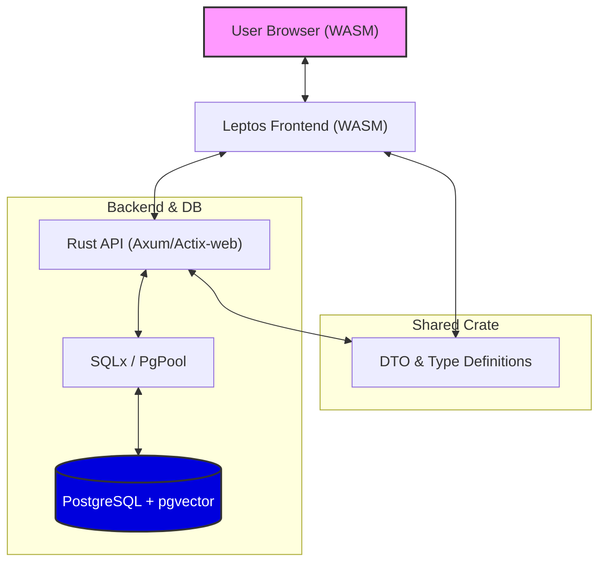
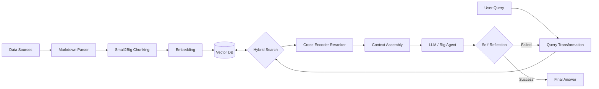
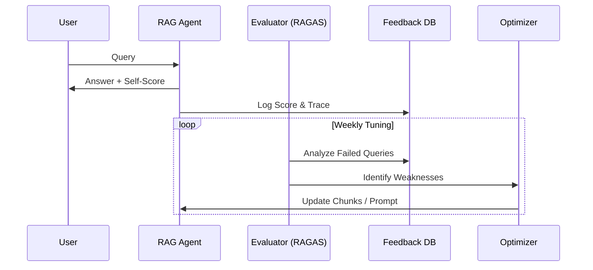

# Draw.io で作成する多面的アーキテクチャ図（ソース）

Draw.io の 「配置」 -> 「挿入」 -> 「高度」 -> 「Mermaid...」 に以下のコードを貼り付けることで、高度なアーキテクチャ図を作成できます。

## 1. 全体スタック図 (Rust + PostgreSQL + Leptos)

## 2. 高度なRAGパイプライン図

## 3. 自己向上ループ (Self-Improving Loop)

